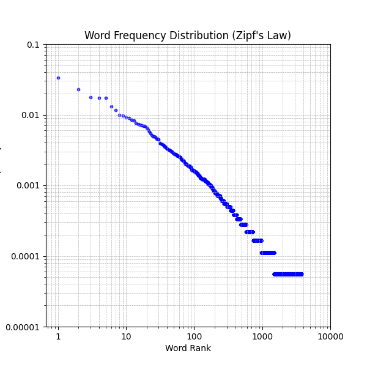

# Zipf's Law

I saw [this](https://youtu.be/fCn8zs912OE) Vsauce video on Zipf's Law
and about five minutes in I was like "I need to test that" so naturally
I loaded up Zed and pulled the text corpus of Macbeth from shakespeare.mit.edu
to see if it held up.

## Results

I ran the script on Macbeth and got the following results:

Curiously, it works out pretty well haha! xD
